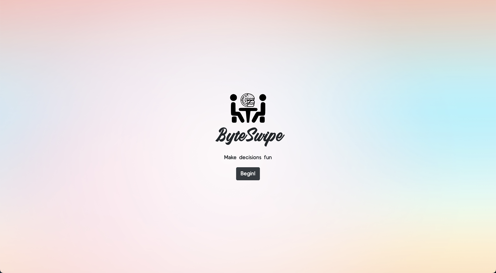
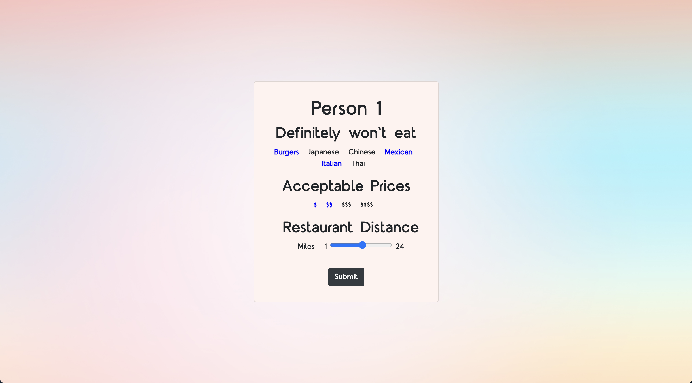
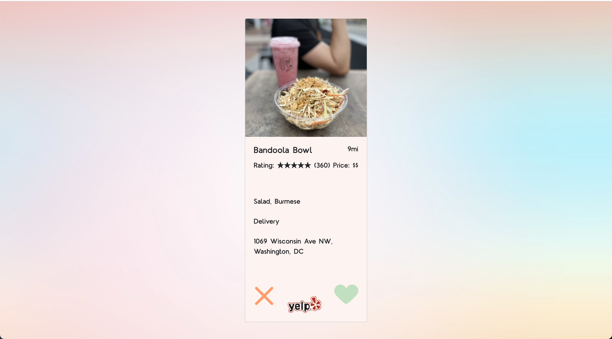
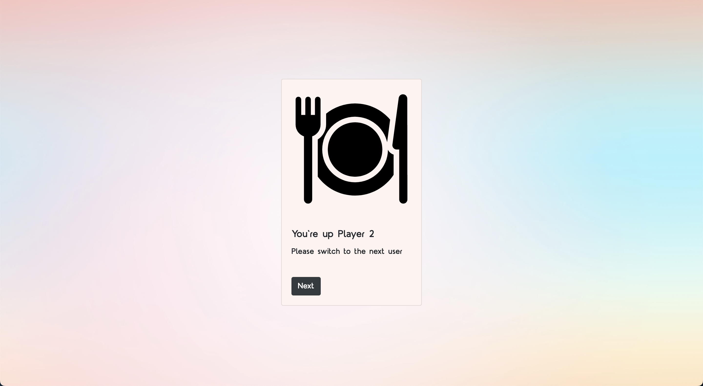
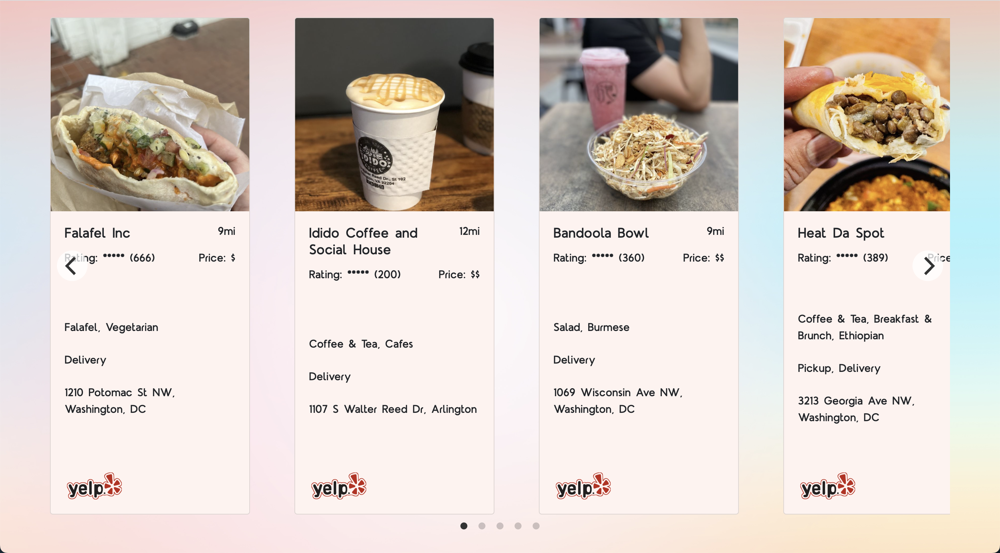

# ByteSwipe
A Tinder style web app for deciding on a restaurant with others!

## Setting up
1. Run Chrome with web security disabled. This is required to bypass errors related
   to Cross-Origin Resource Sharing (CORS). You might need to quit Chrome before running the command.

### Windows
```
"C:\Program Files (x86)\Google\Chrome\Application\chrome.exe" --disable-web-security --disable-gpu --user-data-dir=~/chromeTemp
```

### macOS
```
open -n -a /Applications/Google\ Chrome.app/Contents/MacOS/Google\ Chrome --args --user-data-dir="/tmp/chrome_dev_test" --disable-web-security
```

2. Visit the website [https://kylehassold.github.io/](https://kylehassold.github.io/) in Chrome.

## Home Page


## Filter Pages
First, each user can filter restaurants by excluding certain food categories, setting a price range, and setting a
maximum distance.




## Restaurant Cards
After both users have entered their preferences, we query the Yelp API for restaurants in their area that match the 
selection. Then, we generate cards for each of the restaurants containing information about it, a Yelp link,
and buttons to like or reject the restaurant.


## Swap Users
When the first user has gone through 5 restaurant cards, it swaps to the second user. They will be able to swipe through
all the restaurants the first user liked plus a few more to bring the total to 5.


## Matches
The users continue swapping and swiping through 5 restaurants at a time until there are 5 matches. These matches are displayed
in a carousel.


## Technologies
- JavaScript
- HTML
- CSS
- Node.js
- Bootstrap
- jQuery
- Yelp Fusion API
